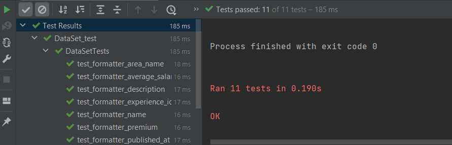

Было создан декоратор профилизатор в файле Vacancie  
В классе InputConnect был добавлен вариант действия программы "Время", с помощью которого замерялось время действия функции и выводилось в консоль  
Также были созданы 3 варианта функции получения года публикации вакансии, они находятся в классе Vacancie

Результаты замеров:
1)   
  
2)  
  
3)  
  

По итогу был выбран первый вариант, через получение подстроки